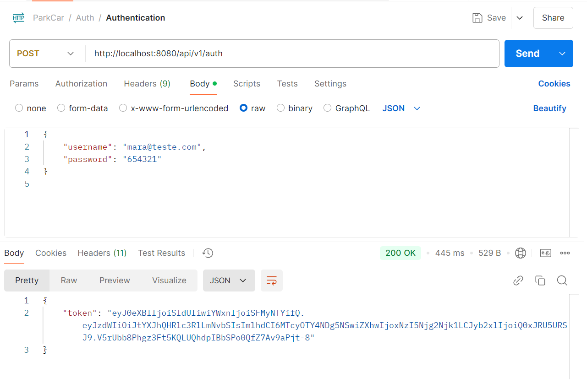
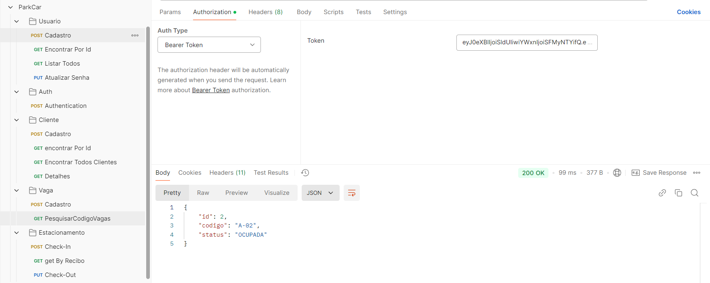
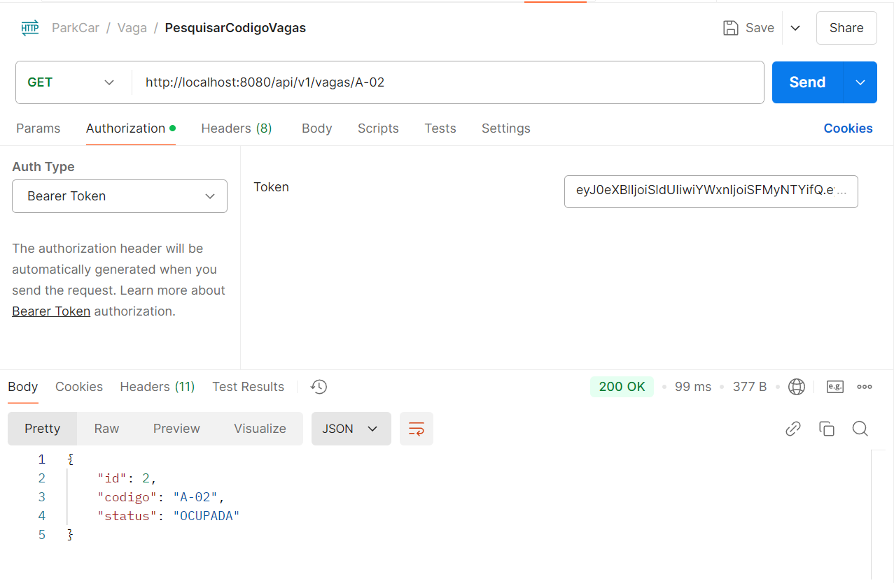
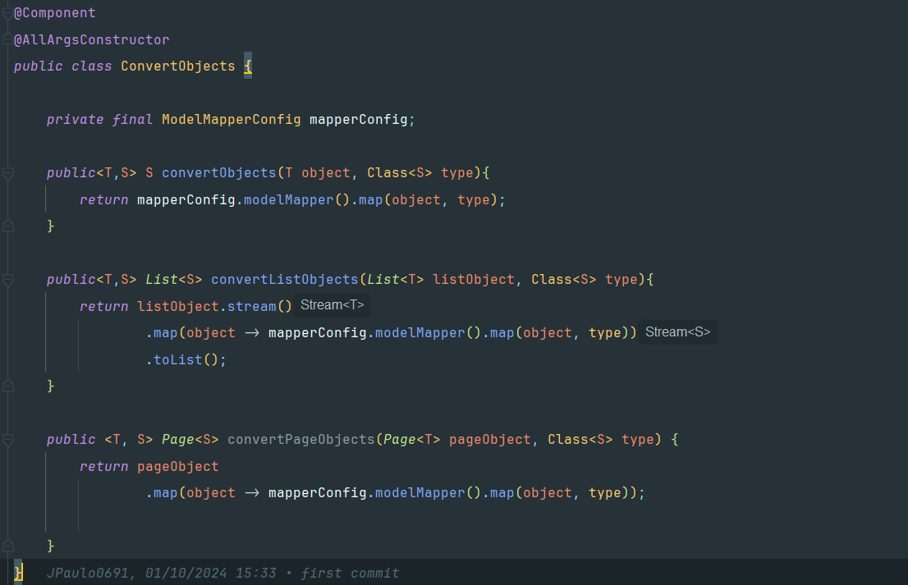
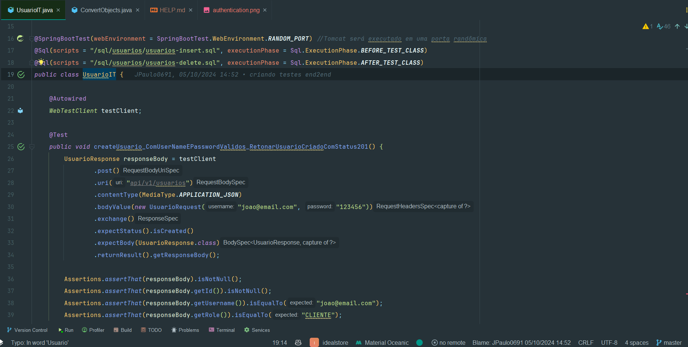

# Ideal Store

**DOC IMAGES**
**Auth**

**ENDPOINTS**

**POSTMAN: COLLECTION - VAGA**


**Using ModelMapper - Converting Objects**


**End2End Test**



## Overview
Ideal Store is a web application designed to manage user registrations, authentications, and other related operations. The project is built using Java and Spring Boot, with a focus on security and data validation.

## Technologies Used
- **Java**: The primary programming language used for the backend development.
- **Spring Boot**: A framework that simplifies the development of Java applications, providing various features such as dependency injection, web security, and more.
- **Spring Security**: Used for securing the application, managing user authentication and authorization.
- **Spring Data JPA**: Simplifies the data access layer by providing a repository-based approach.
- **Hibernate**: An ORM framework used for mapping Java objects to database tables.
- **Maven**: A build automation tool used for managing project dependencies and building the project.
- **Jakarta Validation**: Used for validating user inputs.
- **Swagger**: Used for API documentation and testing.
- **ModelMapper**: A library used for object mapping.
- **JUnit 5**: Used for writing and running tests.
- **AssertJ**: A fluent assertion library used for writing assertions in tests.
- **H2 Database**: An in-memory database used for testing purposes.
- **JWT (JSON Web Token)**: Used for securing API endpoints by providing token-based authentication.

## Project Structure
The project follows a standard Spring Boot structure:
- `src/main/java`: Contains the main application code.
  - `controller`: Contains REST controllers for handling HTTP requests.
  - `dto`: Contains Data Transfer Objects for request and response payloads.
  - `entity`: Contains JPA entities representing database tables.
  - `exception`: Contains custom exception classes and handlers.
  - `mapper`: Contains classes for converting between entities and DTOs.
  - `repository`: Contains Spring Data JPA repositories for data access.
  - `security`: Contains security configurations and services.
  - `service`: Contains service classes implementing business logic.
  - `utils`: Contains utility classes.
- `src/test/java`: Contains test classes for unit and integration testing.
- `src/main/resources`: Contains application configuration files.

## Getting Started
### Prerequisites
- Java 17 or higher
- Maven 3.6 or higher

### Installation
1. Clone the repository:
   ```sh
   git clone https://github.com/yourusername/idealstore.git
   cd idealstore